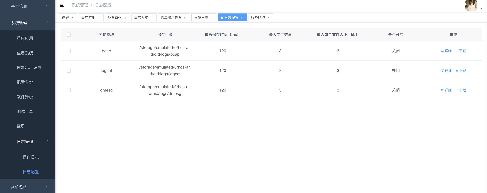
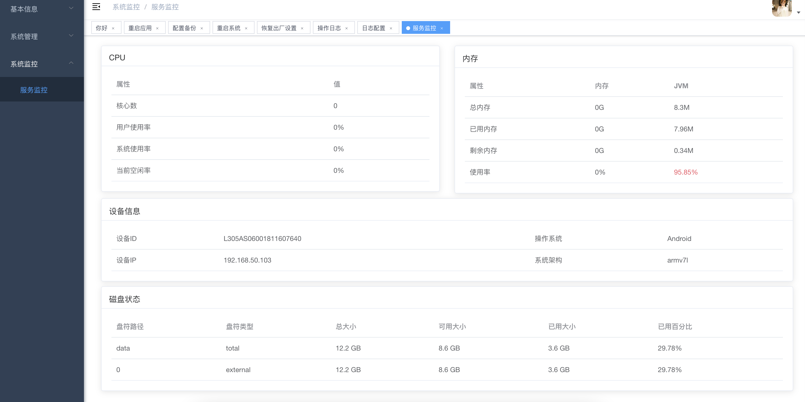
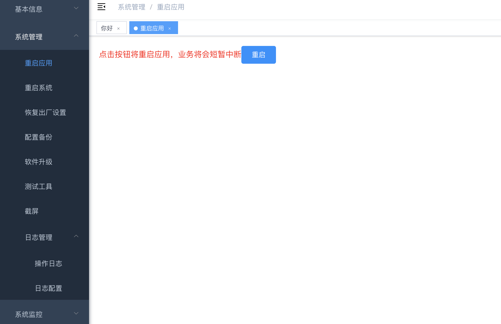
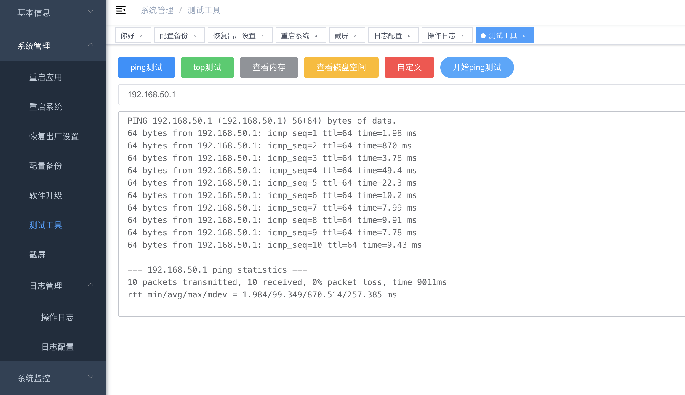

## 开发

```bash
# 克隆项目 (请用https的形式克隆，因为里面包含的子模块都是以https的形式添加的)
git clone https://github.com/netwolf712/hcs-web-maintain.git

# 下载子模块
# 依赖的web子模块有
# 页面框架模块 hcs-web-module-base https://github.com/netwolf712/hcs-web-module-base.git
# 通用运维管理模块 hcs-web-module-maintain https://github.com/netwolf712/hcs-web-module-maintain.git
进入hcs-web-maintain目录后，调用
git submodule update --init --recursive
递归下载子模块

# 建议不要直接使用 cnpm 安装依赖，会有各种诡异的 bug。可以通过如下操作解决 npm 下载速度慢的问题
npm install --registry=https://registry.npmmirror.com

# 修改vue.config.js里的代理路径
#  devServer: {
#    host: "0.0.0.0",
#    port: port,
#    open: true,
#    proxy: {
#      // detail: https://cli.vuejs.org/config/#devserver-proxy
#      [process.env.VUE_APP_BASE_API]: {
#        //运行hcs-android的app的设备的地址
#        target: `http://192.168.50.103:8080`,
#        changeOrigin: true,
#        pathRewrite: {
#          ["^" + process.env.VUE_APP_BASE_API]: "",
#        },
#      },
#    },
#    disableHostCheck: true,
#  },

# 启动服务
npm run dev
```

浏览器访问 http://localhost:80

## 发布

```bash
# 构建测试环境
npm run build:stage

# 构建生产环境
npm run build:prod
```
## node版本
实测v13.14.0正常，其它版本不能确定。
注：可以用nvm管理多个node版本

## 后台程序

hcs-android https://github.com/netwolf712/hcs-android 上的app，或者其他调用了hcs-android中lib-hcs-android-maintain模块的项目

## 示例图片
- 示例图片
<table>
    <tr>
        <td></td>
        <td></td>
    </tr>
    <tr>
        <td></td>
        <td></td>
    </tr>       
</table>